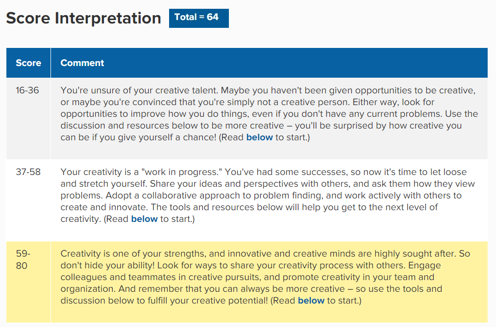

<html>
<head>

<title>Arvee's e-Portfolio</title>
<meta name="viewport" content="width=device-width, initial-scale=1">

</head>

  <h1>Arvee Joshua Villahermosa</h1>
  
E - P O R T F O L I O

  <a href="#section1">Main Page</a>
  <a href="#section2">About IT</a>
  <a href="#section3">Ideal Job</a>
  <a href="#section4">Personal Profile</a>
  <a href="#section5">Project Idea</a>

<body>

  

      

      <h2>Past Education</h2>
      <strong>Student Number</strong>
      
S3776250

      <strong>Student Email</strong>
      
S3776250@student.rmit.edu.au

      <strong>GitHub Link</strong>
      
https://github.com/ArveeVil
      
      <strong>Phone Number</strong>
      
+61422561772

    

      

      <h2>My Details</h2>

      <strong>
Holy Infant Academy 
(2004-2016) (Elementary & Partial Secondary)
      </strong>

      <strong>
Wellington Secondary College 
(2016-2018) 
(Senior High School)
      </strong>

      <strong>
Goulburn Valley Institute of TAFE  (2018-2020) 
(Cyber Security Tafe Course)
      </strong>

    

   

   
  

     

      <h2>Personal Information</h2>
      

       
      
My full legal name is Arvee Joshua Argente Villahermosa.  
I'm 21 years old, with 30th of November as my date of birth.  
I am Asian, specifically Filipino, who originated from Philippines and then migrated to Australia on 2016.  
I can speak both my native language, Tagalog, and English (which was taught at the same time).  
I am currently studying a course about Introduction to Information Technology through Royal Melbourne Institute of Technology (RMIT).  
I love Japanese culture, but more on Anime and Manga, as they are my primary time-killers.  
Also, Pokémon is the best thing ever. 
And yes, I eat Pineapples on a Pizza.

    

  

  

 

 

      <h2>Interest in IT</h2>
      

      <h3>Coping up with world's technological advancement</h3>
<h4>The future and IT are both interconnected.</h4>
What finds it interesting for me is that our world is continuously getting futuristic and it is getting vast. I would want to make sure I always catch up, and so this made me start to believe learning all about Information Technology can help me get there.
 
<h3>Why choose RMIT?</h3>
<h4>It's not a question of why-- it Should Be RMIT.</h4>
Sure, there are a lot of other universities that can provide IT courses as well. But their realistic visions, motivating goals and the values they represent had got me into them. RMIT will prepare me for success (even if there are a lot of errors involving IT), exposes me with new ideas and equip me with skills and knowledge I have not acquired or can improve, and then excel into it so it can show me a proper path in my career. 
 
<h3>IT Expectations</h3>
<h4>Learning is not that easy, but can be eager for it.</h4>
Because of the course being online, there are some areas, specially hands-on ones, will be difficult to learn. However, that doesn't stop as someone like me whose motivated to pass this course. Being introduced to Information Technology, I'm keen to know more about how we can apply IT in our daily lives, its impact (both postive and negative), what are its advantages and disadvantages, and then learning how can I implement myself in contributing to one.
 

 

     

     

      <h2>Ideal Job</h2>
      

       
      <h3>Multimedia Specialist is my ultimate ideal job to have.</h3>

As a specialist in this area, you have to  create and manipulate the animation, audio, video and graphic from computers to multimedia programs. They are the ones responsible in  produce data and content for the physical disks found inside DVDs or game trays.

These can also be found in places such as multimedia presentations, mobile telephone resources,  information kiosks, websites, electronic gaming environments, e-commerce & e-security solutions, and entertainment & education products.

This position interests me so much because I am able to express my own creative designs without any limitations (though its possible I am given with a template), as well as being tasked to develop them without any hindrance from the a company's request.

The idea in this multimedia specialist is they combine the analyzation, design and development from software programming and scripting languages, which I am currently invested to learn to get experience of, then apply it, which made this very appealing for me.

    

    

  

      

      <h2>Key Skills</h2>

      <strong>Project Management</strong>
      
★★★★

      <strong>Software Development</strong>
      
★★☆☆

      <strong>Budgeting & Cost Analysis</strong>
      
★★☆☆
      
      <strong>Enterprise Resource Planning</strong>
      
★★☆☆

      <strong>Staff and User Training</strong>
      
★★★☆

      <strong>Process Improvement</strong>
      
★★★☆

      <strong>Leadership</strong>
      
★★★☆

    

      

This position clearly states that it needs skills,  experience and qualifications. Experience in producing audio and video content, skills in commercial, industry, or academic creative production environments, with demonstrable competencies in OES preferred products and technologies, and qualification in media production and market readiness with an eLearning/academic focus.

Aside from the given key skills I have listed above, my experience still needs attention as I am currently just a student, however, after that's met and done, I am able to qualify for the job of Multimedia Specialist.

    

    

    

	

 

      <h1>Personal Profile</h1>
      

     

     

      <h2>Learning-Style Test</h2>
      <h3>Primary Choice: Pragmatist Style   Secondary Choice: Reflector Style</h3>
      

         
        
        
    

    

  

      

      <h2>Myers-Briggs Type Indicator</h2>
      <h3>My result is Advocate</h3>
      
 
       
    

    

      <h2>Test Website Links</h2>
      
<strong>Personality-Type Site</strong> 
      <a href="https://www.16personalities.com/">Visit 16 Personalities Website</a>  
      <strong>Learning-Type Site</strong> 
      <a href="emtrain.eu/learning-styles">Visit Emtrain's Learning Style Quiz</a>  
      <strong>Creative-Type Site</strong> 
      <a href="https://www.mindtools.com/pages/article/creativity-quiz.htm">Visit Mindtools' Creativity Quiz</a>
    

    

 
    

      <h2>Creativity Test</h2>
      <h3>The result is under the 59-80 range with 64 points</h3>
      
 
        
        
    

    

    

    

      <h2>The Results</h2>

      <strong>What the results mean for me?</strong>
      
It means that I can be relatively unique since in the first test, it is considered to be rarest as an Advocate. One of the major factor for this is my combination of personality traits that makes them complex and quite versatile. Based on the other tests as well, my strengths comes passionately hard from creativity, imagination and sensitivity, which I truly believe I possess, that made it even better, as this will become useful for my ideal job in the future. However, I should note that I should be careful at times because being able to think in abstract doesn't mean I can use it in concretely real life.

      <strong>Results influencing my behaviour in a team:</strong>
      
Being an advocate also signifies standing up for what is right, and thus impacts others to do the same thing. The results tell me I am able to uplift and helping others when facing hardships and so this will gain me a great positive influence on my team. On that note, my tests have told me there will be potential frustrations to people and myself if people, or in this case, my team doesn't appreciate my best intentions for them so I should take considerations to counter this. 
   
      <strong>Taking the result into account when making a team:</strong>
      
When forming a team, I will take in account of my weaknesses, and my loopholes in my personalities so that any problems that surfaces will be negated by my member's strengths, and instead will make my team with a better cooperation. For example, it is said that my personality will most likely reluctant to open up, causing burden and dishonesty in the group but if my members are extroverts who lighten up the atmosphere, it will break my comfort zone and actually be able to avoid that weakness.

    

    

 

    

    

      <h1>Project Idea</h1>
 
     
    

    

 

